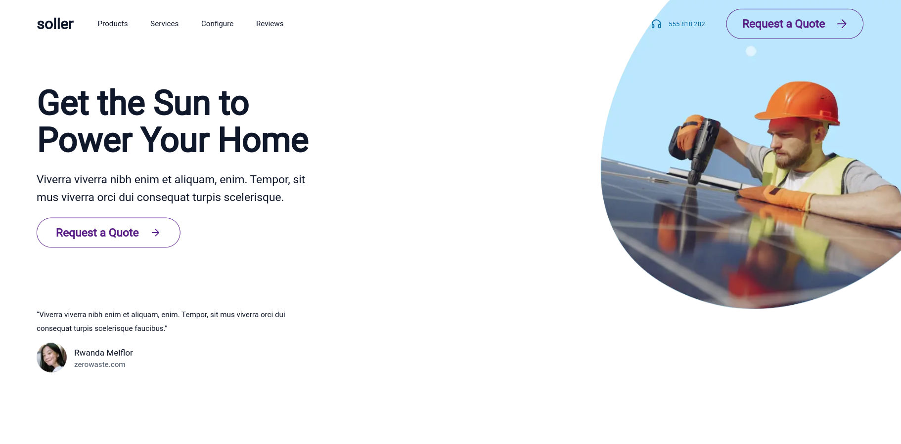

<div align="center" id="top">
  

  &#xa0;

  <!-- <a href="https://sollertest2024nextjs.netlify.app">Demo</a> -->
</div>

<h1 align="center">Soller Test 2024 Nextjs</h1>

<p align="center">
  

  

  

  

</p>

<hr> -->

<p align="center">
  <a href="#dart-about">About</a> &#xa0; | &#xa0;
  <a href="#sparkles-features">Features</a> &#xa0; | &#xa0;
  <a href="#rocket-technologies">Technologies</a> &#xa0; | &#xa0;
  <a href="#white_check_mark-requirements">Requirements</a> &#xa0; | &#xa0;
  <a href="#checkered_flag-starting">Starting</a> &#xa0; | &#xa0;
  <a href="#memo-license">License</a> &#xa0; | &#xa0;
  <a href="https://github.com/andrelinos" target="_blank">Author</a>
</p>

<br>

## :dart: About ##

Describe your project

## :sparkles: Features ##

:heavy_check_mark: Navigate;

## :rocket: Technologies ##

The following tools were used in this project:

* **Next.js 14:** A React framework for building high-performance web applications.
* **TypeScript:** A statically typed superset of JavaScript that adds optional types.
* **React Hook Form:** A library for building forms in React.
* **Zod:** A TypeScript-first schema validation library.
* **Tailwind CSS:** A utility-first CSS framework for rapidly building custom user interfaces.
* **GSAP:** A JavaScript animation library.
* **@gsap/react:** A React wrapper for GSAP.
* **Iconoir:** A collection of customizable icons.
* **Lucide React:** A set of React icons.
* **@hookform/resolvers:** Resolvers for React Hook Form, including support for Zod.
* **shadcn-ui:** A UI component library for rapidly building interfaces.
* **embla-carousel-react:** A library for creating carousels.****

## :white_check_mark: Requirements ##

Before starting :checkered_flag:, you need to have [Git](https://git-scm.com) and [Node](https://nodejs.org/en/) installed.

## :checkered_flag: Starting ##

```bash
# Clone this project
$ git clone https://github.com/andrelinos/soller

# Access
$ cd soller

# Install dependencies
$ npm install

# Run the project
$ npm run dev

# The server will initialize in the <http://localhost:3000>
```

## :memo: License ##

This project is under license from MIT. For more details, see the [LICENSE](LICENSE.md) file.

Made with :heart: by <a href="https://github.com/andrelinos" target="_blank">Andrelino Silva</a>

&#xa0;

<a href="#top">Back to top</a>
